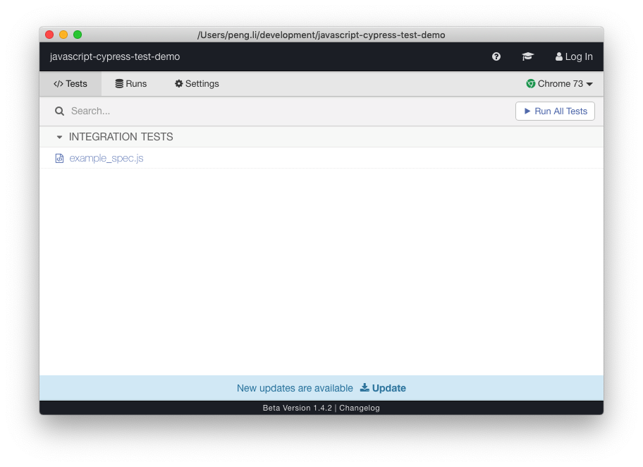
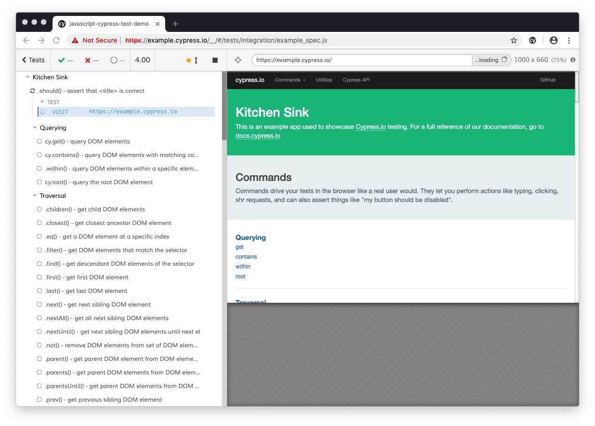

JavaScript Cypress Integration Test Demo
==========================================

Cypress需要安装在本地，调用浏览器自动运行一些integration测试。

在首次安装的时候，它会自动创建`cypress`目录，还在里面加入了一个`example_spec.js`演示了各种用法。

```
npm install
npm run test:open
```

将打开cypress相应的浏览器，以可视的方式运行测试。

or 

```
npm run test:run
```

将在后台执行测试，还会在`cypress/videos`下，生成相应的视频！





